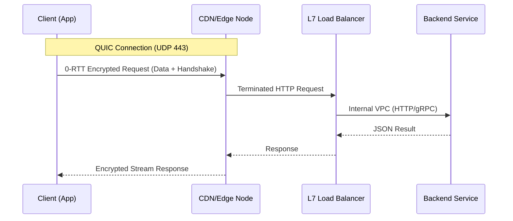

# API Request Lifecycle: Expert Analysis (從網域訪問到 API 響應：專家級深度解析)

## I. Problem Statement & Nuances (題目與細節)
Examine the lifecycle of an API request from a networking and systems perspective. Beyond the basics, how do protocol optimizations like TLS 1.3 and QUIC impact this journey?
從網路與系統架構的角度，分析 API 請求的生命週期。除了基本流程外，TLS 1.3 與 QUIC 等協定優化如何影響這段路程？

**Nucleus Insights (核心觀點):**
- **DNS Recursive vs. Iterative**: Understanding how the browser eventually finds the Authoritative Name Server. (瀏覽器如何最終找到權威名稱伺服器。)
- **Latency Budget (RTT)**: Most of the time is spent on handshakes before the first byte of data is sent. (大部分時間花在發送第一位元組前的多次交握。)
- **OSI Layer 4 vs Layer 7**: Where the load balancer sits and how it terminates SSL. (負載均衡器的位置及其處理 SSL 終端的方式。)

---

## II. Mechanical Deep-Dive: Protocol Handshakes (底層原理：協定交握)

### 1. TCP + TLS 1.2 vs 1.3
In **TLS 1.2**, we need 2 RTTs for the secure handshake. **TLS 1.3** reduces this to 1 RTT, and **0-RTT** is possible for resuming connections.
在 **TLS 1.2** 中，需要 2 次往返時間 (RTT) 完成加密交握。**TLS 1.3** 將其減少至 1 次，且支援 **0-RTT** 恢復連線。

### 2. HTTP/3 (QUIC)
Built on UDP, HTTP/3 combines the transport (TCP) and security (TLS) handshakes into one, drastically lowering the "Time to First Byte" (TTFB).
基於 UDP 的 HTTP/3 將傳輸 (TCP) 與安全 (TLS) 交握合而為一，大幅降低「首位元組時間」(TTFB)。

---

## III. Quantitative Analysis Table (量化指標分析)

| Phase (階段) | Est. Latency (預估延遲) | RTT Count | Impact (影響) |
|---|---|---|---|
| **DNS Lookup** | ~50 - 500 ms | 1+ | Cached vs Uncached. (有無快取差異巨大。) |
| **TCP (SYN/ACK)** | ~20 - 100 ms | 1 RTT | Minimal setup cost. |
| **TLS 1.2 Handshake**| ~50 - 200 ms | 2 RTTs | High cost for new connections. |
| **TLS 1.3 Handshake**| ~25 - 100 ms | 1 RTT | **50% Reduction** in handshake cost. |
| **HTTP/3 (QUIC)** | ~20 - 100 ms | 0-1 RTT | Performance champion in unstable networks. |

---

## IV. Ecosystem Comparison (生態系橫向對比)

| Protocol | Transport | Multiplexing | Resiliency (韌性) |
|---|---|---|---|
| **HTTP/1.1** | TCP | None (Head-of-line blocking) | Low (New conn needed) |
| **HTTP/2** | TCP | Binary Streams (Multiplexed) | Medium (TCP loss stalls all) |
| **HTTP/3** | UDP (QUIC)| Native Stream Multiplexing | **High** (Single packet loss doesn't stall all) |
| **gRPC** | HTTP/2 | ProtoBuf Optimized | High (for Microservices) |

---

## V. Sequence Diagram: Modern 0-RTT Request (時序圖：現代 0-RTT 請求)

---

## VI. Failure Modes & Edge Cases (失敗模式與邊界)

1. **BGP Hijacking**: Attackers broadcast false routes to steal traffic at the ISP level. (攻擊者在 ISP 層級發布錯誤網關路由以竊取流量。)
2. **Zombie Connections**: Connections that seem alive but are stalled at a middle-box (Firewall/NAT). (看似活著但在中間設備如防火牆中斷的連線。)
3. **Head-of-Line (HOL) Blocking**: In HTTP/2, if one TCP packet is lost, all streams are blocked. HTTP/3 solves this by using independent streams over UDP. (在 HTTP/2 中，單個 TCP 丟包會阻塞所有串流。HTTP/3 透過 UDP 獨立串流解決。)

---

## VII. Technical Term Dictionary (技術術語字典)

| Term (術語) | Translation (中文翻譯) | Description (說明) |
|---|---|---|
| TTFB | 首位元組時間 | Time from request sent to first byte received. (從發送請求到收到第一位元組的時間。) |
| SSL Termination | SSL 終端 | Decrypting traffic at the Load Balancer before sending to backend. (在負載均衡器解密流量，再傳入後端。) |
| CDN | 內容傳遞網路 | Geographically distributed servers that cache content. (地理分佈的快取伺服器。) |
| QUIC | 快速 UDP 網路連線 | Google-designed UDP-based transport protocol. (Google 設計的基於 UDP 的傳輸協定。) |
| Recursive Resolver | 遞迴解析器 | The server that finds the DNS answer for the client. (替客戶端找尋 DNS 答案的伺服器。) |
