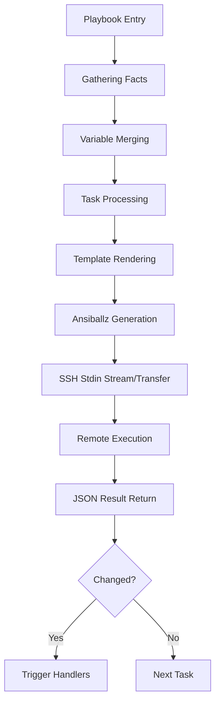

# Technical Core: Ansible Automation & Infrastructure Masterclass

> **導讀**：Ansible 不僅是自動化腳本的集合，它是一種**宣告式 (Declarative)** 的配置管理哲學。本文旨在從底層執行邏輯、併發性能優化到測試驅動開發 (TDD)，全方位解析如何利用 Ansible 構建數千台規模的自動化體系。

---

## 🏗️ 第一章：宣告式哲學與核心機制 (Core Philosophy)

### 1. 宣告式 (Declarative) vs. 指令式 (Imperative)
- **指令式 (Shell/Python Script)**：描述「如何做」（先安裝 A，再設定 B，檢查 C）。必須手動處理錯誤與狀態檢查。
- **宣告式 (Ansible)**：描述「最終狀態」（確保 Nginx 已安裝且正在運行）。Ansible 引擎負責處理中間的邏輯與狀態轉移。

### 2. Idempotency (冪等性) 的實現原理
Ansible 模組的核心在於其具有「狀態感知」能力。它在執行每個任務前會：
1. **檢查當前狀態 (Current State)**。
2. **比較期望狀態 (Desired State)**。
3. **僅在狀態不匹配時執行變更 (Task Execution)**。

### 3. 任務執行流 (Task Lifecycle)


---

## 🧩 第二章：資深級目錄結構與角色 (Roles & Structure)

一個可擴展的 Ansible 專案不應只有一個大型 Playbook，而應採用 **Role-based** 架構。

### 1. 標準目錄佈局 (Best Practice)
```text
ansible-project/
├── group_vars/          # 針對不同環境的變數 (dev, stage, prod)
├── host_vars/           # 針對特定主機的變數
├── inventory/           # 動態或靜態主機清單
├── roles/               # 可複用的邏輯單元
│   └── common/
│       ├── tasks/
│       ├── templates/
│       ├── handlers/
│       └── meta/        # 定義依賴關係
└── site.yml             # 主入口點
```

### 2. include_role vs. import_role
- **import (Static)**：在解析 Playbook 時載入。高效，但無法動態決定載入。
- **include (Dynamic)**：在執行 Task 時才載入。支援 `when` 條件判斷。

### 3. 多層級變數優先權 (Variable Precedence)
Ansible 共有 22 個優先級層次，理解這一點是處理複雜環境（Multi-environment）的關鍵。主要遵循以下邏輯：
1. **最高級**：`-e` (Extra variables) 指定。
2. **中級**：`role_vars` 與 `host_vars`。
3. **低級**：`group_vars/all` 與 `defaults/main.yml`。

> [!TIP]
> **最佳實踐**：在 Role 的 `defaults/` 中定義預設值，在 `group_vars/` 中定義環境差異，僅在緊急修補時才使用 `extra_vars`。

---

## ⚙️ 第三章：高性能與大規模併發 (Scaling & Performance)

當受控節點達到數百或數千台時，預設配置會成為瓶頸。

### 1. 通道加速：Pipelining & ControlMaster
- **Pipelining**：減少 SSH 連線次數，模組直接透過 stdin 執行。
- **ControlMaster**：在主進程保持 SSH 連線，避免重複的握手開銷。

### 2. 併發策略 (Execution Strategy)
- **Linear (預設)**：所有任務同步執行（Task 1 跑完所有機台才跑 Task 2）。
- **Free**：各跑各的。適合初始化安裝（一機台跑完所有 Task 就結束）。
- **Serial (滾動更新)**：指定 batch 數量，這是在產線進行 **Blue-Green Deployment** 的核心。

### 3. 插件體系 (Plugins & Extensions)
Ansible 具備強大的擴充性，不僅僅依賴模組。
- **Lookup Plugins**：在主進程中獲取外部數據（如從 HashiCorp Vault 讀取密碼、讀取 CSV 文件）。
- **Filter Plugins**：自定義 Jinja2 過濾器，處理複雜的字串轉換（例如：`{{ password | my_custom_encrypt }}`）。
### 4. Mitogen 插件
- **進階優化**：透過二進制傳輸取代原生的 Ansiballz，可減少 30-50% 的執行時間。

---

## 🔒 第四章：安全性與秘鑰管理 (Security & Vault)

### 1. Ansible Vault
- **AES-256 加密**：保護敏感資訊（密碼、Token、證書）。
- **多密鑰支援**：針對不同的環境使用不同的 `--vault-id`。

### 2. 持續化秘鑰流
在 CI/CD 中，應搭配 HashiCorp Vault 的 Lookups 插件來實現在執行時才獲取秘鑰。這避免了在 Git 中存儲即使是加密過的靜態秘鑰的風險。

---

## 🛠️ 第五章：進階邏輯控制 (Advanced Logic)

### 1. 條件判斷 (Conditionals)
利用 `when` 根據 Facts 或變數決定任務是否執行。
```yaml
- name: Install Apache only on Linux
  apt: name=apache2 state=present
  when: ansible_os_family == "Debian"
```

### 2. 循環處理 (Loops)
使用 `loop`（舊版使用 `with_items`）來批量處理清單。
```yaml
- name: Add multiple users
  user: name={{ item.name }} state=present groups={{ item.groups }}
  loop:
    - { name: 'alice', groups: 'wheel' }
    - { name: 'bob', groups: 'dev' }
```

### 3. 錯誤處理 (Error Handling)
透過 `block`, `rescue`, `always` 實現類似 Try-Catch 的邏輯。這對於配置網路介面等高風險作業至關重要。

---

## 🛠️ 第六章：測試驅動開發 (IaC TDD)

高質量的 IaC 必須具備自動化測試。

### 1. Molecule 生命週期
Molecule 模擬完整的基礎設施生命週期：
1. **Dependency**: 安裝必要 Collection。
2. **Lint**: 語法檢查。
3. **Create**: 啟動 Docker / EC2 沙盒。
4. **Converge**: 執行 Playbook。
5. **Idempotence**: 執行二次，確保無變更。
6. **Verify**: 透過 **Testinfra** (Python-based) 驗證系統狀態（如連接埠是否開啟、檔案權限）。

---

## 📈 第六章：方案選型對比 (Ansible vs. Others)

| 維度 | Terraform | **Ansible** | Puppet / SaltStack |
| :--- | :--- | :--- | :--- |
| **主要定位** | 基礎設施調配 (Provisioning) | **配置管理 (Config Management)** | 配置管理 (Config Management) |
| **架構** | 無代理 | **無代理** | 有代理 (Agent-based) |
| **狀態管理** | 基於 State 文件 | **基於受控端實際狀態** | 基於中央 Master 狀態 |
| **最佳配合** | TF 定義基礎設施 (VM/Network) | **Ansible 配置 OS 內部細節** | 適合持續性強制一致性 |

---

## 🏢 第八章：企業級管理 (Ansible AWX / Tower)

對於企業環境，我們需要圖形化管理與角色權限控制 (RBAC)。
- **JOB Templates**：預定義常用的自動化任務。
- **Workflow Visualizer**：視覺化編排多步自動化流程（例如：Provision -> Config -> Verify）。
- **Rest API Support**：讓其他業務系統能輕鬆調用自動化任務。

---

## 🛠️ 第九章：自定義開發 (Extending Ansible)

當現有模組無法滿足需求時，我們可以進行擴充：

### 1. 自定義 Python 模組
Ansible 模組本質上是接收 JSON 並輸出 JSON 的 Python 腳本。開發時需遵循 `AnsibleModule` 規範以支援 `check_mode`。

### 2. 動態變數處理
利用 `vars_prompt` 進行交互式輸入，或透過 `vars_files` 根據環境動態加載不同的敏感配置。

---

## 🔐 第十章：合規即代碼 (Compliance as Code)

透過 **OpenSCAP** 與 Ansible 的整合，我們能實現：
- **自動化掃描**：檢查系統是否符合定級保護或 ISO27001 要求。
- **自動化補救**：一鍵讓數百台異質伺服器回歸合規狀態。

---

## 💡 第十一章：面試兵法 (Resume Highlights)

### 如何展現資深深度？
- **精準定義**：不要說「我會寫 Playbook」，要說「我透過 **Roles** 封裝了可高度複用的組件，並導入了 **Molecule** 實作 IaC 的持續整合」。
- **解決痛點**：強調你如何透過 **Strategy: Free** 與 **Forks 調優**，將原本 2 小時的維護作業縮短至 10 分鐘。
- **安全思維**：說明你如何整合 **Ansible Vault** 並遵循最小權限原則進行自動化部署。

---

### 關鍵金句總結
- **「Ansible 不是腳本，它是對系統期望狀態的代碼化定義。」**
- **「沒有自動化測試 (Molecule) 的基礎設施代碼，僅僅是另一種形式的手動操作風險。」**
- **「透過 Ansiballz 的內部機理優化，我們能在不犧牲安全性的前提下，實現海量節點的高度一致性。」**
