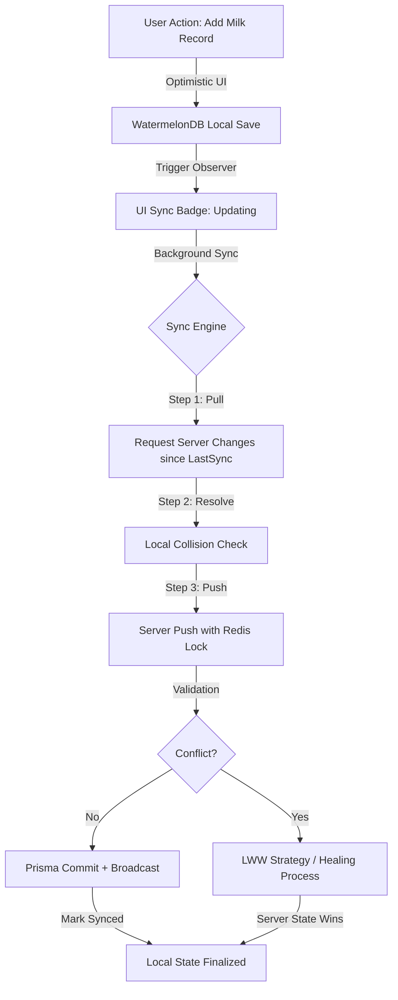

# Architect's Journal: Baby Tracker (Offline-First 實作紀錄)

> **紀錄者語**：這份筆記記錄了我在開發 Baby Tracker 時，針對「高併發、零延遲、分散式一致性」所做的架構抉擇。這不僅是一個記錄工具，更是一個解決雙親在極端環境下同步資訊的技術挑戰。

---

## 🏗️ 核心架構視圖 (Architecture Vision)

在設計之初，我便決定將「離線能力」作為核心需求，而非事後補丁。傳統的 Cloud-first 架構在電梯裡、醫院診間或網路不穩的育兒場景中會徹底失效。

### 核心技術棧 (Technical Stack)
- **Client-side DB**: [WatermelonDB](https://nozbe.github.io/WatermelonDB/) (Reactive, Observable)
- **Sync Protocol**: 自研增量同步引擎 (Incremental Sync)
- **Server-side Engine**: Node.js (Express 5) + Prisma
- **Data Persistence**: PostgreSQL 16 + Redis (Distributed Locking)
- **Build Tool**: **Rolldown-Vite** (極限優化建構速度)

---

## 🔄 技能工作流 (Skill Work Flow)

以下展示了一個資料變動從本地 mutation 到全域一致的生命週期：



---

## 🛠️ 技術深潛 (Technical Deep-Dive)

### 1. 為什麼選擇 WatermelonDB 而非 PouchDB/RxDB？
這是架構設計中最重要的決策點。

| 維度 | PouchDB / RxDB | **WatermelonDB** |
| :--- | :--- | :--- |
| **底層模型** | Document-based (CouchDB style) | **Relational (SQLite/LokiJS)** |
| **性能** | 隨數據量增加，查詢速度下降明顯 | **Lazy loading 模式，支援數萬筆數據** |
| **抽象層** | 較重，包含所有同步邏輯 | **極簡，僅提供 Hook 讓開發者自定義 Sync** |
| **本專案考量** | 需要處理複雜的統計 (如喝奶量曲線)，Document 查詢太慢 | **適合複雜關聯查詢，且啟動速度極快** |

### 2. LWW (Last Write Wins) vs. CRDT (Conflict-free Replicated Data Types)
在 Baby Tracker 這種場景下，CRDTs (如 Automerge) 同步成本過高且複雜。

- **決策結果**：採用 **LWW (Last Write Wins)**。
- **實作細節**：
    - 每個 Record 帶有一個 `version` 與 `updated_at`。
    - 當客戶端推送 (`push`) 一個版本低於伺服器當前版本的數據時，伺服器會拒絕併發送 **"Healing"** 封包，要求客戶端強制以伺服器狀態為準。
    - 這在育兒場景中極為有效，因為雙親通常不會「同時」修改同一筆換尿布紀錄。

### 3. Redis 分佈式鎖定 (Distributed Concurrency Control)
為了防止同一個帳號 (Family ID) 在多個設備同時觸發同步導致的 Race Condition，我引入了 **Redis 分佈式鎖**。

```typescript
// server/services/sync_lock.ts (邏輯概念)
const locker = new Redlock([redis]);
const lock = await locker.acquire([`sync_lock:${familyId}`], 5000);
try {
    const changes = await processSync(pushData);
    return changes;
} finally {
    await lock.release();
}
```

---

## 📈 應用場景與實戰價值 (Application & Impact)

- **場景 A：醫院診間 (極弱網環境)**
    - 父母依然可以記錄體溫與醫囑，UI 響應為 0ms。
    - 走出醫院後，系統自動觸發背景同步，另一方的 App 即時收到「Healing」後的正確時間軸。
- **場景 B：併發衝突**
    - 媽媽修改下午 2 點的喝奶量，爸爸同時刪除該紀錄。
    - 後端透過 `Prisma $transaction` 與庫存 `updated_at` 判定，最終由伺服器最新狀態勝出，保持數據零髒讀。

---

## 💡 關鍵面試亮點 (Resume Talking Points)

- **「我不只是做離線快取，我是實作了一套以『本地資料庫為單一事實來源 (SSoT)』的同步協議。」**
- **「透過選型 WatermelonDB 並搭配自研 LWW + Healing 機制，我平衡了開發成本與極致的使用者體驗。」**
- **「在高頻同步場景中，我利用 Redis 分佈式鎖取代資料庫層級的鎖，大幅降低了 PostgreSQL 的 IOPS 壓力。」**
