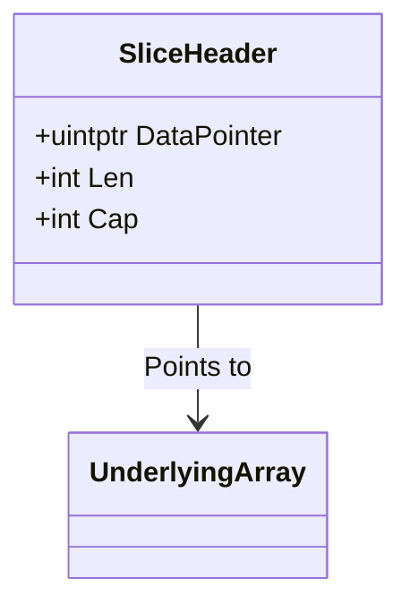

# Go 語言實戰教材：從入門到大規模工程應用 (究極完整版)

這是一份專為現代開發者設計的 Go 語言教材。內容不僅涵蓋語法，更深度結合了本專案生產環境中的實際架構（如 Gin, eBPF Agent 底層通訊），旨在透過真實案例幫助你掌握 Go 的「工程哲學」。

---

## 1. 語言結構與工程佈局 (Project Layout)

Go 檔案由三大部分構成，這種結構確保了編譯速度與模組化的清晰度。

*   **`package`**：定義作用域。全專案唯一的進入點必須是 `package main`。
*   **`import`**：顯式引入依賴，未使用的 import 會導致編譯失敗（強制規範）。
*   **`func`**：邏輯封裝。

### 語法範例 (`main.go`)
```go
package main 

import (
    "fmt"      // Formatting: 標準輸出
    "os"       // OS: 環境變數、檔案操作
    "log"      // Logging: 系統日誌
)

func main() {
    // 程式從這裡開始執行
    port := os.Getenv("SERVER_PORT") 
    fmt.Printf("🚀 Server is starting on port %s\n", port)
}
```

---

## 2. 型別系統與簡短宣告 (Types & Variables)

Go 是強型別、靜態編譯語言，這為大規模重構提供了安全保障。

*   **`var`**：通用宣告。
*   **`:=`**：**自動推導 (Short Variable Declaration)**。開發中最常用，但限制於區域變數。
*   **多重回傳 (Multiple Returns)**：這是 Go 處理「錯誤」的核心方式。

### 實戰案例：Token 生成 (`auth.go`)
```go
func GenerateToken(userID string) (string, error) {
    // time.Duration 與 time.Time 的計算
    expirationTime := time.Now().Add(24 * time.Hour) 
    
    // 返回結果與 nil (表示無錯誤)
    return tokenString, nil 
}
```

---

## 3. 接收者模型 (Receiver) —— Go 的物件導向哲學

Go 放棄了 `class` 與虛函數表，轉而使用 **Receiver**。這是區分初學者與資深開發者的關鍵。

### Value vs. Pointer Receiver

| 類型 | 語法 | 記憶體行為 | 使用情境 |
| :--- | :--- | :--- | :--- |
| **Value Receiver** | `(s MyStruct)` | 拷貝整個物件 | 唯讀方法、小資料 |
| **Pointer Receiver** | `(s *MyStruct)` | **傳遞記憶體位址 (8 bytes)** | 需要修改狀態、大結構體 |

```go
type SSHConfig struct {
    Host string `json:"host"`
    Port int    `json:"port"`
}

// 指標接收者：用於修改內部連線狀態
func (s *SSHConfig) UpdatePort(newPort int) {
    s.Port = newPort
}
```
> [!TIP]
> **工程建議**：在實務中，95% 的方法應使用 **Pointer Receiver**，以保持性能並確保狀態修改的一致性。

---

## 4. 組合優於繼承 (Struct Embedding & Interfaces)

### 4.1 Struct Embedding (匿名嵌入)
Go 沒有 `extends`，我們透過嵌入來達成代碼復用。

```go
type BaseModel struct {
    ID uint `json:"id" gorm:"primarykey"`
}

type User struct {
    BaseModel  // User 自動繼承 ID 欄位
    Name string
}
```

### 4.2 隱式介面 (Implicit Interfaces)
這被稱為「鴨子類型」(Duck Typing)。你不需要顯式宣告 `implements`，只要實作了介面的方法，你就「是」該介面。

```go
type AuthProvider interface {
    Validate(user, pwd string) (bool, error)
}

// LDAPAuth 只要實作 Validate 方法，就能傳入任何接受 AuthProvider 的函式中
type LDAPAuth struct{}
func (l LDAPAuth) Validate(u, p string) (bool, error) { ... }
```

---

## 5. 數據結構：Slice 的底層模型

Slice 是 Go 最具巧思的設計，其底層是一個 24-byte 的 Header。



### 5.1 複合結構範例
```go
// Slice: 長度可變的動態陣列
ips := []string{"127.0.0.1", "192.168.1.1"} 

// Map: 雜湊表，用於快速檢索
configs := map[string]string{
    "db": "host=localhost;port=5432",
}
```

---

## 6. 控制流程與錯誤管理 (Control & Error)

### 判斷前置語句 (If-with-Init)
```go
if err := DB.Ping(); err != nil {
    log.Fatalf("Connection failed: %v", err)
}
```

### 錯誤是「值」而非「異常」
Go 不使用 try-catch。這要求開發者必須顯式處理每一個可能的異常，確保系統的健壯性。
```go
// Error Wrapping (Go 1.13+)
return fmt.Errorf("failed to process: %w", err)
```

---

## 7. Context：請求生命週期的總司令

在微服務中，`Context` 是傳遞超時、中斷訊號與追蹤標籤的最佳工具。

```go
func QueryDB(ctx context.Context) {
    select {
    case <-time.After(2 * time.Second): // 模擬耗時操作
        fmt.Println("Done")
    case <-ctx.Done(): // 如果用戶取消請求，立即釋放資源
        fmt.Println("Cancelled")
    }
}
```

---

## 8. 並發之魂：Goroutine 與 GMP 模型

Go 的高併發不是靠提升線程數量，而是靠 **M:N 調度 (GMP Model)**。

*   **G (Goroutine)**：輕量級協程 (2KB)。
*   **M (Machine)**：OS 線程。
*   **P (Processor)**：本地調度隊列，負責將 G 分配給 M。

```go
// 啟動一個協程處理背景任務
go func() {
    processLogs(logChan)
}()
```

---

## 9. Gin 框架與中間件架構 (RESTful API)

本專案後端採用 Gin 框架，其核心在於 **Middleware Chain**。

```go
func AuthMiddleware() gin.HandlerFunc {
    return func(c *gin.Context) {
        token := c.GetHeader("Authorization")
        if token == "" {
            c.AbortWithStatusJSON(401, gin.H{"error": "Unauthorized"})
            return
        }
        c.Next() // 執行下一個 Handler
    }
}
```

---

## 10. 現代 Go 泛型 (Generics)

Go 1.18 引入的泛型，大幅減少了 `interface{}` (any) 斷言的使用。

```go
// 通用排序或查找工具
func Contains[T comparable](s []T, v T) bool {
    for _, a := range s {
        if a == v {
            return true
        }
    }
    return false
}
```

---

## 📚 學習路線建議

1.  **基礎掌握**：熟悉 `:=` 與 `if err != nil` 的節奏。
2.  **核心對齊**：理解指標接收者與介面的隱式實作。
3.  **異步思維**：掌握 Goroutine 與 Channel 的通訊，了解不可變數據的重要性。
4.  **工程實踐**：學習 `context` 調度與 `gin` 中間件開發。

---
💡 **結語**：Go 的靈魂在於「簡單」與「顯式」。當你不再尋找簡寫方法，而是開始重視每一個錯誤處理時，你就真正進入了 Go 的工程師之道。
