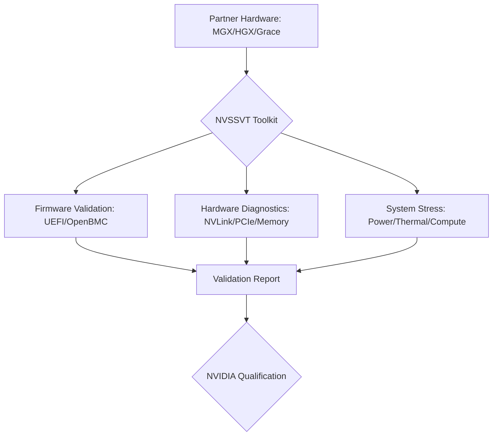

# Technical Core: NVSSVT (NVIDIA System Software Validation Toolkit) Masterclass

> **導讀**：隨著 AI 與加速運算需求的爆發，伺服器系統的「軟硬體協同驗證」已成為關鍵。**NVSSVT** 是 NVIDIA 認證體系中的核心工具包，旨在確保系統底層韌體（UEFI BIOS/OpenBMC）與高密度硬體（Grace Hopper, NVLink）在極端負載下的高度一致性與可靠性。

---

## 🏗️ 第一章：定義與架構定位 (Architectural Role)

### 1. 什麼是 NVSSVT？
**NVSSVT (NVIDIA System Software Validation Toolkit)** 是 NVIDIA **Qualified System Test Suite (QSTS)** 的重要組成部分。
- **目標**：驗證系統軟體與韌體（UEFI BIOS、OpenBMC）是否符合 NVIDIA 的效能、安全性與兼容性標準。
- **對象**：OEM/ODM 製造商（如 Supermicro, Quanta, GIGABYTE），在產品開發（Qualification）階段進行系統級驗證。

### 2. 核心架構示意圖

### 3. 生態系價值：為何 OEM 爭相投入？
獲得 **NVIDIA Certified System** 標誌是進入高端 AI 市場的入場券。NVSSVT 確保了即使伺服器由不同的廠商（如 Supermicro 或 GIGABYTE）製造，其針對大規模 AI 訓練的可靠性也完全一致。

---

## 🧩 第二章：三大驗證支柱 (Validation Pillars)

理解 NVSSVT 的核心在於掌握其「全方位的健康檢查」邏輯。

### 1. 軟體環境與佈署預檢 (Pre-flight Checks)
在進入硬體壓力前，必須確保驅動程序與程式庫層級的正確性：
- **NVML & CUDA Access**：確認系統能正確調用 NVIDIA 管理庫，且版本相互兼容。
- **Library Versioning**：檢測共用庫 (Shared Libraries) 是否因環境變數衝突導致載入失敗。

### 2. 韌體驗證 (Firmware Verification)
在現代伺服器中，韌體直接影響 GPU 與 CPU 的互連效率。
- **UEFI BIOS**：驗證 PCIe 枚舉、ACPI 表格正確性、以及對 NVIDIA 特有功能（如 Resizable BAR, Multi-Instance GPU）的支持。
- **OpenBMC**：測試系統遙測 (Telemetry) 數據的正確性、散熱風扇控制邏輯以及 FRU (Field Replaceable Unit) 的資訊同步。

### 3. 硬體完整性診斷 (Hardware Integrity)
- **NVLink/PCIe 檢測**：測量鏈路帶寬，檢查 **Replay Counter** 以識別潛在的信號干擾或組裝缺陷。
- **內存韌性 (Memory Resiliency)**：監控修正錯誤 (CE) 與不可修正錯誤 (UE)，驗證 **Row-Level ECC** 功能。
- **Topo Check**：確保系統拓撲（CPU-GPU, GPU-GPU）符合 NVIDIA 推薦的最佳資料路徑。

### 4. 極限壓力測試 (System Stress)
- **Sustained Power Load**：在高負載下維持特定功耗 (TDP)，觀測電壓穩定度。
- **Thermal Stabilization**：模擬數據中心的高溫環境，測試系統在 Thermal Throttling 觸發前的極致性能。

---

## ⚙️ 第三章：硬體專項 — Grace/Grace Hopper (GH200)

針對 NVIDIA 最新架構，NVSSVT 提供了專門的驗證模組，重點在於全新的連通性架構：

### 1. Grace CPU 專項
- **Arm-based Logic Check**：驗證作業系統（通常是 RHEL 或 Ubuntu Server）對 NVIDIA Grace CPU 核心調度與能效切換的支持。
- **LPDDR5X 內存驗證**：測試 LPDDR5X 在 500GB/s 頻寬下的數據完整性（Data Integrity），這是餵飽 AI 模型計算的關鍵。

### 2. GH200 晶片間互連 (C2C Interconnect)
這是 Grace Hopper 的靈魂。NVSSVT 會針對 **C2C (Chip-to-Chip)** 提供以下診斷：
- **Coherency Check**：確保 CPU 與 GPU 之間的內存空間是一致且透明的（Unified Memory）。
- **Bandwidth Benchmarking**：驗證 900 GB/s 的 C2C 雙向頻寬是否達標。

### 3. MGX 模組化平台
由於 MGX 是模組化設計，NVSSVT 需要驗證不同主機板與 GPU 基座 (Baseboard) 組合後的系統穩定度。這包含對不同 **NVIDIA BlueField-3 DPU** 組合後的 PCIe 拓撲自動掃描。

---

## 🛡️ 第四章：NVRAS 整合與可靠性驗證

NVSSVT 不僅檢查效能，更與 **NVRAS (Reliability, Availability, and Serviceability)** 深度整合。

### 1. 錯誤注入 (Error Injection)
為了驗證系統在硬體故障時的韌性，我們會使用工具進行模擬：
- **PCIe Error Injection**：測試系統是否能正確捕捉到 Correctable Error 並記錄在 BMC Log 中。
- **Memory Row-Retirement**：驗證當某行內存出現過多 CE 時，系統是否能自動將其「退役 (Retiring)」以防止後續的 UE (Uncorrectable Error)。

### 2. 遙測日誌分析 (Telemetry Analysis)
NVSSVT 會抓取 OpenBMC 的資料流，分析與溫度、電壓、風扇轉速相關的 **Thresholds**。這在資深硬體工程師進行「散熱微調」時具有極大的參考價值。

---

## 🧪 第五章：NVSSVT vs. NVVS (Validation Suite)

這是面試時最常被混淆的考點：

| 維度 | **NVSSVT** (System Software Toolkit) | **NVVS** (NVIDIA Validation Suite) |
| :--- | :--- | :--- |
| **使用階段** | **研發與產線驗證 (Qualification)** | **生產環境部署與運維 (Deployment)** |
| **核心用戶** | 硬件工程師、BIOS/BMC 開發者 | 數據中心運維人員、系統管理員 |
| **主要功能** | 韌體合規性、極限硬件壓力 | 叢集就緒度檢測、驅動配置錯誤診斷 |
| **工具角色** | 確定「這台機器設計是否合格」 | 確定「這台機器現在是否能跑 job」 |

---

## 🔄 第六章：診斷工作流 (Diagnostic Workflow)

在實際驗證中，我們遵循以下排錯流程：

1. **環境初始化**：驗證 NVML (NVIDIA Management Library) 與 CUDA 環境是否正確載入。
2. **靜態檢查**：檢查 PCIe 拓撲與時鐘同步情況。
3. **基準測試**：執行輕量化的性能基準 (Benchmarks)，獲取初始得分。
4. **複合壓力 (Heavy Stress)**：同時開啟 CPU/GPU/Memory/Disk IO 壓力，持續 24-72 小時。
5. **後置分析**：分析日誌中的 XID Error 與系統日誌 (dmesg)，判斷失效原因。

---

## 🛠️ 第七章：診斷金句與實務技巧 (Cheat Sheet)

### 常見失效模式與應對：
- **PCIe Bandwidth Drop**：通常與 BIOS 的 ASPM 設定或信號衰減有關。
- **XID 61/62 (GPU Bus Error)**：需檢查散熱模組壓力是否不均，導致封裝 (Package) 接觸不良。
- **OpenBMC Telemetry Lag**：確認 I2C/IPMI 定時器衝突或 BMC 負載過高。

---

## 🤖 第八章：自動化與 CI/CD 整合

在資深的驗證流程中，我們不會手動逐台執行 NVSSVT。

### 1. 基於 Python 的自動化封裝
我們會撰寫 Wrapper 腳本來自動化執行流程：
- **Auto-Config**：自動生成針對不同 SKU (如 H100 vs H200) 的設定檔。
- **Log Aggregation**：將所有節點的驗證日誌匯總至中央 ELK 平台進行大數據分析。

### 2. 產線自動化 (Manufacturing Integration)
NVSSVT 可以整合入生產線的 **FATP (Final Assembly & Test Process)** 階段。透過 PXE Boot 進入驗證環境，達成全自動的無人值守測試。這對於數公里的「AI 工場 (AI Factory)」機架級交付至關重要。

---

## 🏭 第九章：AI 工場 (AI Factory) 部署挑戰

在大規模部署 GH200 或 H100 叢集時，NVSSVT 扮演了「門神」的角色：

1. **機架級一致性檢測**：確保一整排機架 (Rack) 中的 32 或 64 個節點具有完全一致的 BIOS 版本與功耗限制。
2. **UVM (Unified Memory) 壓力補償**：驗證在極端 CPU-GPU 記憶體交換壓力下，Page Fault 處理機制是否會導致系統崩潰。
3. **高速網路協同**：在使用 **InfiniBand / RoCE** 網路時，NVSSVT 會與外部診斷工具配合，驗證 NCCL (NVIDIA Collective Communications Library) 在實體鏈路上的表現。

---

## 🔍 第十章：深入 XID Error 分析

當 NVSSVT 報報報錯時，我們通常會看到 XID 代碼。理解這些代碼是資深驗證工程師的價值所在：

| XID 代碼 | 本質含義 | 可能原因 |
| :--- | :--- | :--- |
| **XID 61** | GPU 內部微控制器報錯 | 散熱不均或核心電壓不穩 |
| **XID 31** | GPU 內存初始化失敗 | 硬件損壞或 BIOS 初始化順序錯誤 |
| **XID 79** | GPU 掉卡 (Bus Timeout) | PCIe 信號眼圖不佳或電源供應中斷 |

---

## ⚙️ 第十一章：BIOS Tuning 與 效能邊解 (Fine-tuning)

NVSSVT 的結果可以用來指導 BIOS 的深度微調：
- **ASPM (Active State Power Management)**：若 PCIe 帶寬不穩，需檢查 BIOS 是否錯誤啟用了 L1 substates。
- **SR-IOV & VT-d**：在虛擬化場景下，驗證 IOMMU 映射是否會對 NVSSVT 的壓力測試產生額外的 Latency。
- **ACS (Access Control Services)**：確保 P2P (Peer-to-Peer) 通訊不會被 BIOS 錯誤地重新導向至 CPU。

---

## 📡 第十二章：NVSwitch 與 大規模互連驗證

在 **HGX/MGX** 系統中，NVSSVT 需要與 **NVSwitch** 配合：
- **Fabric Health Check**：驗證全網狀 (Full Mesh) 拓撲在高負載下的電氣特性。
- **Multi-Node Sync**：確保數千個 GPU 同步觸發計算任務時，電源供應器 (PSU) 的動態響應正常。

---

## 🔐 第十三章：韌體安全與合規 (Security)

NVSSVT 也包含了對系統安全性的檢測細項：
- **Secure Boot 驗證**：確保系統僅載入經由簽名的 NVIDIA 驅動與韌體組件。
- **TPM 整合檢查**：驗證加密金鑰在系統啟動過程中的安全性。
- **Signed Firmware Updates**：模擬韌體更新流程，確保 OpenBMC/BIOS 的簽章驗證機制無誤。

---

## 💡 第十一章：面試兵法 (Resume Highlights)

### 如何描述 NVSSVT 經驗？
- **深度整合**：不要說「我跑過這個工具」，要說「我利用 **NVSSVT** 建立了一套針對 **MGX 平台** 的自動化驗證流程，並藉此提早識別了 BIOS 在處理 **GH200** 內存映射時的關鍵缺陷」。
- **專業關聯**：將 NVSSVT 的結果與 **NVRAS** 框架掛鉤，展現您對伺服器「高可用性與可服務性」的全面理解。
- **解決痛點**：描述您如何利用 **Telemetry 數據** 成功定位了散熱氣流 (Airflow) 的死角，解決了在高負載下的 Thermal Throttling 問題。

### 關鍵金句總結
- **「NVSSVT 是伺服器軟硬體的試金石。沒有通過它，數據中心級別的系統穩定性無從談起。」**
- **「我對驗證的理解不只是跑 Pass/Fail，而是透過工具發出的 XID Error 與 Telemetry 數據，逆向推導出韌體或硬體層級的缺陷。」**
- **「在高密度 AI 伺服器年代，NVSSVT 縮短了從實驗室到大規模部署之間的最後一哩路。」**
