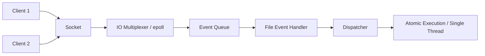

# Technical Core: Redis 深度解析與專家指南 (Comprehensive Masterclass)

> **導讀**：Redis 不僅僅是一個 Key-Value 緩存，它是一個極限優化、多功能的內存數據結構儲存系統。本文旨在從底層哲學、數據結構、高可用架構到分佈式併發控制，全方位構建 Redis 的技術知識體系。

---

## 🏗️ 第一章：核心設計與 IO 模型 (Core Philosophy)

### 1. 為什麼 Redis 那麼快？
- **純內存操作**：所有數據存儲在內存中，遠超磁碟 I/O 速度（Nano-seconds vs Milli-seconds）。
- **高效的數據結構**：專為速度設計（例如跳表 SkipList, 壓縮列表 ZipList）。
- **單執行緒 Reactor 模型**：避免了多執行緒的上下文切換 (Context Switch) 與鎖競爭 (Lock Contention)。
- **IO 多路複用 (IO Multiplexing)**：利用 `epoll` 實現單個線程處理數萬個併發連線。

### 2. Reactor 模型示意圖


### 3. Redis 6.0+ 的多執行緒
對於現代的高頻場景，網路讀寫 (Network IO) 成為瓶頸。Redis 6.0 引入了**多執行緒 IO (Threaded IO)**，但核心的**命令執行依然是單執行緒**，保持了原子性。

### 4. 核心 IO 線程流程 (IO Threading Flow)
當網路請求到達時：
1. **讀取 (Read)**：多個 IO 線程並行讀取 Socket 中的數據。
2. **解析 (Parse)**：IO 線程解析請求命令。
3. **執行 (Execute)**：**主線程單執行緒**執行命令，確保數據一致性。
4. **回傳 (Write)**：多個 IO 線程將結果寫回 Socket。

---

## 🧩 第二章：數據結構深潛 (Data Structures)

Redis 的靈魂在於其多樣化的數據類型，每種都有其特定的邊界與應用場景。

### 1. 字串 (String) — 並不只是字串
- **實作**：SDS (Simple Dynamic String)，預配緩衝區以減少內存重分配。
- **應用**：分散式鎖 (`SETNX`)、計數器 (`INCR`)、分佈式 Session。
- **面試題**：為什麼不用 C 原生字串？(Ans: SDS 獲取長度 $O(1)$，且二進制安全)。

### 2. 哈希 (Hash) — 對象存儲神器
- **實作**：ZipList (小數據) 或 Dict (大數據)。
- **應用**：存儲用戶對象（如 `user:1001` -> `{name: "John", age: 30}`）。
- **優勢**：比 JSON 序列化更節省空間，且支援部分欄位更新。

### 3. 列表 (List) — 高性能隊列
- **實作**：Quicklist。
- **應用**：最新動態列表、Brpop 阻塞式消息隊列。

### 4. 集合 (Set & ZSet)
- **Set**：共同好友（SINTER）、去重統計。
- **ZSet (Sorted Set)**：排行榜的核心。底層使用 **跳表 (SkipList)**。
- **為什麼用跳表而非紅黑樹？** (Ans: 跳表更適合區間查詢 $O(log N)$，實作更簡單且節省內存)。

---

## 💾 第三章：持久化機制 (Persistence)

內存數據是易失的，Redis 提供兩種互補的持久化方案。

### 1. RDB (Redis Database) — 快照模式
- **原理**：定時將全量數據保存為二進制壓縮文件。
- **優點**：恢復速度極快，文件體積小。
- **缺點**：如果崩潰，會丟失最後兩次快照間的所有變更。
- **實質**：利用 `fork()` 產生的子進程（Copy-on-Write）進行背景備份。

### 2. AOF (Append Only File) — 日誌模式
- **原理**：記錄每一條寫命令（Write-ahead logging）。
- **重寫機制 (AOF Rewrite)**：當日誌過大，自動精簡冗餘命令。
- **優點**：數據幾乎不丟失（視 `fsync` 策略而定）。
- **缺點**：文件大，恢復速度比 RDB 慢。

### 3. 混合持久化 (Hybrid) — Redis 4.0+
- **最佳實踐**：結合 RDB 的後半段快照與 AOF 的增量日誌，實現高效、低丟失的恢復。

---

## 🏗️ 第四章：高可用架構 (High Availability)

### 1. 主從複製 (Master-Slave)
- **核心**：數據冗餘與讀寫分离（Read-Scale）。
- **缺陷**：主節點宕機後無法自動切換。

### 2. 哨兵模式 (Sentinel)
- **功能**：監控、通知、自動故障轉移 (Failover)。
- **選舉算法**：Raft 的變種，多個哨兵達成共識後將一名從節點提升為新主節點。

### 4. 高可用架構對比：Sentinel vs. Cluster

| 特性 | **Redis Sentinel** | **Redis Cluster** |
| :--- | :--- | :--- |
| **架構類型** | 中心化監控 (主從 + 哨兵) | 去中心化 (多主多從) |
| **水平擴展** | 較難 (受單機記憶體限制) | **強 (支援分片 Sharding)** |
| **自動切換** | 支援 | 支援 |
| **主要目的** | 解決「單點故障」 | 解決「單機容量/性能瓶頸」 |

---

## 🔒 第五章：併發控制與分佈式鎖 (Concurrency Control)

### 1. 事務 (Transactions)
Redis 事務利用 `MULTI` / `EXEC` / `WATCH` / `DISCARD`。
- **注意**：Redis 事務不具備關係型資料庫的「回滾 (Rollback)」能力，一條失敗，後續繼續。

### 2. Lua 腳本
- **王道實作**：Lua 腳本在 Redis 中是**原子性執行**的。這是在開發複雜業務邏輯（如扣減庫存）時的最佳選擇。

### 3. 分佈式鎖的最佳實踐
- **基礎模式**：`SET lock_key unique_id NX EX 30`。
- **安全性優化**：解鎖時必須使用 Lua 腳本核對 `unique_id`，防止誤釋放其他客戶端的鎖。

```lua
-- 解鎖腳本：確保只有鎖的擁有者能解鎖
if redis.call("get", KEYS[1]) == ARGV[1] then
    return redis.call("del", KEYS[1])
else
    return 0
end
```

### 4. Pipeline 與原子性
- **Pipeline**：將多個命令批量發送，減少網路 RTT (Round Trip Time)。注意：Pipeline **非原子性**。
- **LUA 腳本**：這才是真正的原子複合操作。適用於「查詢 + 判斷 + 修改」的複雜邏輯。

---

## ⚡ 第六章：緩存三座大山 (Performance & Anti-patterns)

### 1. 緩存穿透 (Cache Penetration)
- **現狀**：惡意攻擊查詢不存在的 Key。
- **對策**：
  - **布隆過濾器 (Bloom Filter)**：在大規模查詢前置過濾。
  - **空值緩存**：對不存在的 Key 設置極短過期時間。

### 2. 緩存擊穿 (Cache Breakdown)
- **現狀**：熱點 Key 失效。
- **對策**：**互斥鎖 (Mutex)**，確保只有一個請求去回填數據庫。

### 3. 緩存雪崩 (Cache Avalanche)
- **對策**：過期時間隨機化 (TTL Jitter)、部署多機房。

---

## 🎯 第七章：運維與監控 (Operations)

作為高級工程師，你必須學會診斷 Redis：

### 1. INFO 命令的重要性
- `info memory`: 監控 `used_memory_rss`，判斷是否有內存碎片或洩漏。
- `info stats`: 查看 `keyspace_hits` 與 `misses`，評估緩存命中率。

### 2. 慢查詢與 Big Key 診斷
- `SLOWLOG GET 10`: 找出執行緩慢的命令。
- `redis-cli --bigkeys`: 掃描大 Key，避免 `DEL` 時造成的阻塞。

---

## ⚖️ 第八章：技術選型與對比 (Redis vs. Memcached)

為什麼現在大多數人都選 Redis？

| 維度 | Memcached | **Redis** |
| :--- | :--- | :--- |
| **數據類型** | 僅字串 | 多樣化數據結構 (List, Set, etc.) |
| **持久化** | 無 | 支援 RDB/AOF |
| **執行模型** | 多執行緒 | 單執行緒 (核心) + 多執行緒 IO |
| **主從複製** | 無 (需第三方) | 原生支持 |
| **功能** | 單純緩存 | 緩存 + 消息隊列 + 鎖 |

---

## 🛠️ 第九章：Redis 核心命令速查表 (Cheat Sheet)

### 1. 常用基礎操作
- `KEYS *`: 獲取所有 Key (生產環境禁用！會阻塞主線程)。
- `SCAN 0`: 掃描 Key，非阻塞，推薦替代 `KEYS`。
- `EXPIRE key 60`: 設置過期時間。
- `TTL key`: 查看剩餘過期時間。

### 2. 數據結構操作
- **String**: `SET`, `GET`, `INCRBY` (原子計數)。
- **List**: `LPUSH`, `LPOP`, `BRPOP` (阻塞式彈出，適合 MQ)。
- **Hash**: `HSET`, `HGETALL`, `HINCRBY`。
- **ZSet**: `ZADD`, `ZRANGE`, `ZREVRANK` (獲取排名)。

---

## 🔐 第十章：安全性與防護 (Security)

1. **內置安全機制**：
   - **ACL (Access Control Lists)**: Redis 6.0+ 支持精細的代碼權限與 Key 權限。
   - **內網部署**: 禁止將 Redis 暴露在公網，配置 `bind 127.0.0.1`。
2. **禁用危險命令**：
   - 使用 `rename-command` 在 `redis.conf` 中改名或禁用 `FLUSHALL`, `CONFIG`, `KEYS`。

---

## 💡 第十一章：面試兵法 (Interview Strategy)

### 如何描述 Redis 經驗？
- **量化描述**：提到你如何通過 Pipeline 或 LUA 腳本將 TPS 提升了幾倍。
- **場景導向**：不僅說你會 Redis，要說你如何解決了「多裝置同步時的數據競態」。
- **深度剖析**：如果面試官問到 Redis 為什麼快，你要能從 `epoll` 聊到 `Reactor`模型。

---

### 關鍵金句總結 (The Masterclass Takeaway)
- **「Redis 的單執行緒不是缺點，而是它極致性能與複雜度權衡後的藝術。」**
- **「持久化不只是備份，它是 RDB 恢復速度與 AOF 數據完整性之間的權衡。」**
- **「解決分佈式一致性，鎖是手段，LUA 腳本實現原子性運算是更優雅的工程實踐。」**
