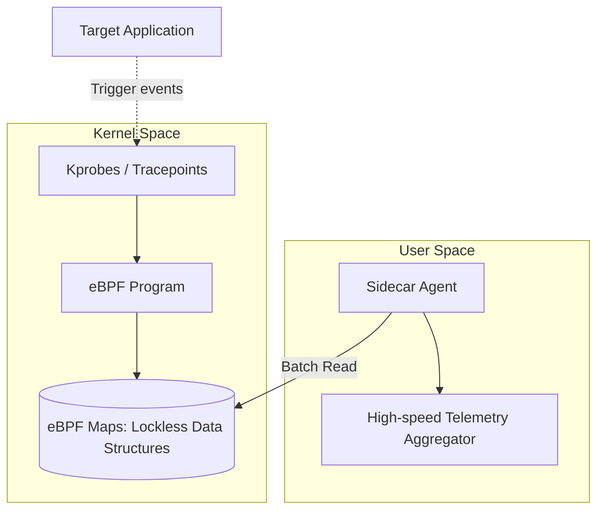

# 數據採集層：底層 Agent 與高性能量測工具 (Measurement Tools) — 研究級深度解析

在大規模計算環境（Fleet-scale computing）中，效能量測的準確性直接決定了資本支出的效率。本文件旨在從架構底層出發，探討如何實作一套「研究級」的數據採集系統，其核心設計哲學在於：**最小化觀測者效應 (Observer Effect)** 並 **最大化指標的物理真實性**。

---

## 一、 硬件層級診斷：PMU 與 `perf_event_open` 的深度鏈結

在 Google 的工程環境中，效能分析不只是看 CPU %，而是要解析處理器內部的 **微架構行為 (Micro-architectural Behavior)**。

### 1.1 性能監控單元 (PMU) 架構
PMU 是處理器內部的一組專用寄存器，用於計數硬體事件（如指令退休、快取缺失）。研究級 Agent 必須直接與 PMU 交互。

### 1.2 技術實作：精準的 `perf_event_open` 調用
我們不依賴 `perf` 指令，而是實作底層 C++ Wrapper 以獲取納秒級的控制權。

```cpp
struct perf_event_attr pe;
memset(&pe, 0, sizeof(struct perf_event_attr));
pe.type = PERF_TYPE_HARDWARE;
pe.size = sizeof(struct perf_event_attr);
pe.config = PERF_COUNT_HW_CPU_CYCLES; // 採集週期
pe.disabled = 1;
pe.exclude_kernel = 1; // 排除核心態干擾，專注於用戶態邏輯
pe.exclude_hv = 1;

int fd = syscall(__NR_perf_event_open, &pe, 0, -1, -1, 0);
```

### 1.3 核心指標的研究價值
*   **IPC (Instructions Per Cycle) 深度解析**：
    *   **低 IPC 的根因分析**：是 Front-end Bound（分支預測錯誤導致 Pipeline 填不滿）還是 Back-end Bound（記憶體延遲導致執行單元停頓）？
    *   **Cycle Accounting**：將 Cycles 拆解為「有效執行」與「停頓 (Stalls)」。
*   **Cache Hierarchy 缺失率**：
    *   不僅關注 L1/L2，更專注於 **LLC (Last Level Cache) Misses per Kilo-Instructions (MPKI)**。這是衡量程序是否發生「內存崩潰 (Memory Thrashing)」的關鍵。

---

## 二、 核心層可觀測性：基於 eBPF 的 Sidecar Profiler

為了實現「零侵入」監控，eBPF (Extended Berkeley Packet Filter) 是目前最頂尖的技術路徑。

### 2.1 eBPF Telemetry Pipeline 架構



### 2.2 非侵入式 I/O 延遲分佈 (Histogram)
研究級監控不看「平均延遲」，因為平均值會掩蓋 **尾部延遲 (Tail Latency)**。我們利用 eBPF 實作線性或對數直方圖採集。

*   **實作細節**：在 `vfs_read` 的 Entry 和 Return 點掛載 BPF 程序，計算差值並存入內核態 Map。
*   **零拷貝 (Zero-copy) 哲學**：僅將聚合後的直方圖數據傳回用戶態，而非每一條 I/O 記錄，極大降低了 context switch 開銷。

### 2.3 網路封包的微秒級追蹤
利用 `fentry/fexit` 監控核心協議棧中的 `tcp_retransmit_skb`，精確分析網路抖動是否源於數據中心交換機的「隱形丟包」。

---

## 三、 專用加速器 (TPU) 的遙測與記憶體壁 (Memory Wall)

對於 TPU 等矩陣運算單元，傳統的 CPU 採集技術完全失效。

### 3.1 TPU 核心架構監控：HBM 與 MXU
TPU 的核心矛盾在於 **內存帶寬 (HBM Bandwidth)** 與 **算力 (FLOPS)** 的失配。

*   **Roofline Model 分析**：
    *   我們通過讀取專有的硬件計數器，計算當前應用的 **運算強度 (Operational Intensity)**。
    *   如果應用的點落在 Roofline 的傾斜部分，說明它是 **Memory-bound**，優化方向應為算子融合 (Operator Fusion)而非優化矩陣運算邏輯。

### 3.2 HBM (High Bandwidth Memory) 吞吐量採集
*   **技術路徑**：透過專用的驅動介面讀取 HBM 控制器的性能寄存器。
*   **指標意義**：
    *   **Read/Write Burst Efficiency**：判斷內存訪問模式是否對齊（Coalesced）。
    *   **TPU Idle Bubbles**：監控 MXU 在等待數據時產生的「氣泡」，這是流水線效率低下的直接證據。

---

## 四、 採集系統的關鍵挑戰：時鐘同步與偏差

在研究級的場景下，多維度數據的 **時間對齊 (Temporal Alignment)** 是最難的課題。

1.  **TSC (Time Stamp Counter) 同步**：跨核採集時，各 CPU 核心的 TSC 可能存在漂移。Agent 需要進行初始化校準。
2.  **Sampling Frequency 與 Nyquist 定律**：
    *   採集頻率過高會導致系統變慢（Heisenbug）。
    *   採集頻率過低會遺漏微秒級的短暫性能峰值（Micro-bursts）。
    *   **解決方案**：採用 **Adaptive Sampling (自適應採樣)**，在系統負載劇烈變化時自動提高採樣頻率。

---

## 結論：邁向自動化性能工程
本設計目標是建立一個「自感知」的基礎設施。透過 Hardware Counters、eBPF 與 Accelerator Telemetry 的垂直整合，我們不僅能看到系統變慢，更能自動推導出「是因為 L3 快取爭用」還是「是因為內核協議棧的鎖競爭」，這才是支持 Google 等級大規模基礎設施優化的核心能力。
